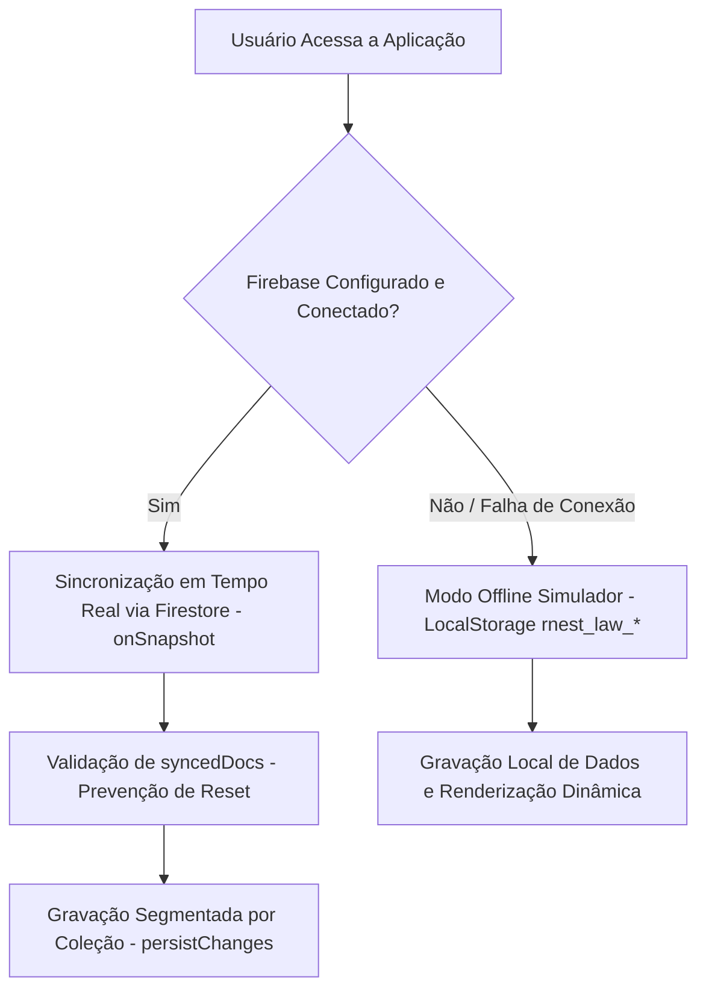
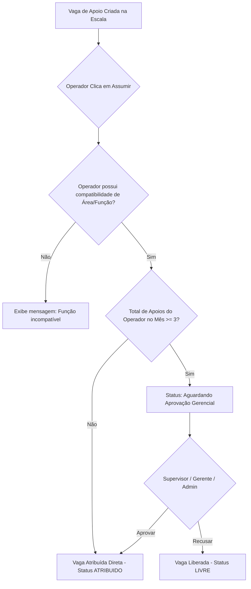
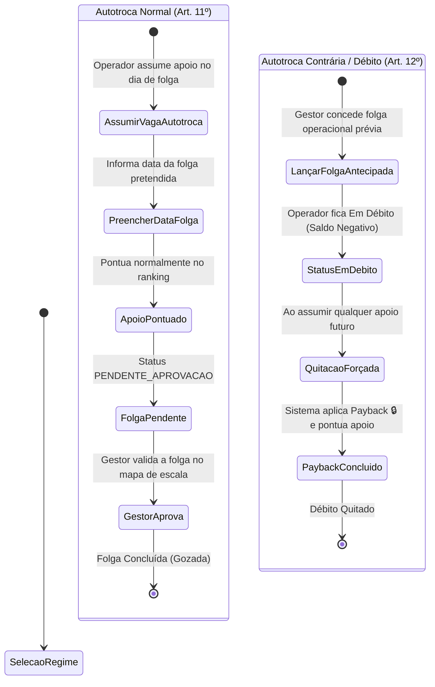
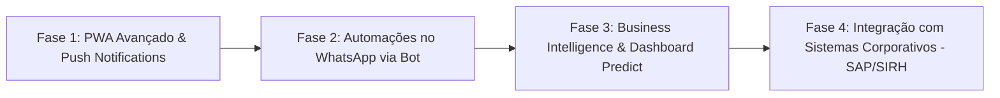

# 📚 GUIA COMPLETO E DEFINITIVO DA APLICAÇÃO APOIO RNEST
> **Sistema Democrático para Distribuição e Gestão de Apoios e Autotrocas de Turno**  
> *Regulamentado pelo Projeto de Lei Nº 0001/2025 (RNEST / TEU / UT)*

---

## 📑 ÍNDICE GERAL

1. [Visão Geral e Propósito do Sistema](#1-visão-geral-e-propósito-do-sistema)
2. [Arquitetura Técnica, Sincronização e Resiliência](#2-arquitetura-técnica-sincronização-e-resiliência)
3. [Perfis de Acesso, Níveis Hierárquicos e Alternador de Modo](#3-perfis-de-acesso-níveis-hierárquicos-e-alternador-de-modo)
4. [Regras de Negócio e Algoritmos do Ranking de Prioridade](#4-regras-de-negócio-e-algoritmos-do-ranking-de-prioridade)
5. [Gestão de Escalas, Limite Mensal e Regra de Bumping (Substituição)](#5-gestão-de-escalas-limite-mensal-e-regra-de-bumping-substituição)
6. [Regramento Completo de Autotrocas (Normal e Contrária / Débito)](#6-regramento-completo-de-autotrocas-normal-e-contrária--débito)
7. [Ferramentas de Auditoria, Comunicação (WhatsApp) e Penalidades](#7-ferramentas-de-auditoria-comunicação-whatsapp-e-penalidades)
8. [Estrutura Interna de Dados e Lógica de Manipulação do Código](#8-estrutura-interna-de-dados-e-lógica-de-manipulação-do-código)
9. [Plano de Ampliação Futura e Evolução Tecnológica](#9-plano-de-ampliação-futura-e-evolução-tecnológica)

---

## 🎯 1. VISÃO GERAL E PROPÓSITO DO SISTEMA

A aplicação **Apoio RNEST** foi desenvolvida para solucionar os desafios históricos de distribuição de vagas de apoio operacional, dobras de turno e concessão de folgas compensatórias no âmbito da **Refinaria Abreu e Lima (RNEST)**.

### Objetivos Principais:
* **Democratização e Equidade**: Eliminar a subjetividade na concessão de apoios, garantindo que colaboradores com menor histórico de apoios acumulados no ano tenham preferência absoluta.
* **Transparência Pública**: Garantir que todos os colaboradores possam auditá-la em tempo real, visualizando pontuações, posições no ranking, justificativas e históricos de lançamentos.
* **Saúde Ocupacional**: Controlar e coibir o excesso de dobras e apoios consecutivos através do limite mensal rígido parametrizado.
* **Agilidade Operacional**: Integrar escalas, cadastros de autotroca e templates formatados para comunicação via WhatsApp em uma única plataforma web/mobile resiliente.

---

## 🛠️ 2. ARQUITETURA TÉCNICA, SINCRONIZAÇÃO E RESILIÊNCIA

A aplicação foi estruturada seguindo o padrão **Vanilla Web App Premium** (HTML5 + CSS HSL + Vanilla JavaScript ES6 puro), sem a necessidade de um ambiente de compilação pesado ou pastas complexas como `node_modules` (que frequentemente são bloqueadas por redes corporativas ou sincronizadores de nuvem como o Google Drive).

### 📂 Estrutura de Arquivos do Projeto:
* [`index.html`](file:///G:/Meu%20Drive/Preoejto%20App%20Apoio%20RNEST/index.html): Estrutura semântica da interface do usuário (UI), modais de interação, abas de navegação, sidebar de ranking e overlays de alerta.
* [`style.css`](file:///G:/Meu%20Drive/Preoejto%20App%20Apoio%20RNEST/style.css): Sistema visual unificado utilizando valores HSL (*Hue, Saturation, Lightness*), estética de modo escuro de alto contraste, glassmorphism (`backdrop-filter`), responsividade para computadores/tablets/smartphones e micro-animações.
* [`app.js`](file:///G:/Meu%20Drive/Preoejto%20App%20Apoio%20RNEST/app.js): Núcleo da lógica da aplicação, reatividade do DOM, regras do ranking, gestão de estado e escutadores de eventos.
* [`data.js`](file:///G:/Meu%20Drive/Preoejto%20App%20Apoio%20RNEST/data.js): Base de dados estática inicial, definições das regras de apoio ($R_1$ a $R_{13}$), lista de colaboradores, tabela de áreas/funções e parâmetros globais.
* [`firebase-config.js`](file:///G:/Meu%20Drive/Preoejto%20App%20Apoio%20RNEST/firebase-config.js): Credenciais de conexão do projeto no Firebase Console.
* [`firebase-db.js`](file:///G:/Meu%20Drive/Preoejto%20App%20Apoio%20RNEST/firebase-db.js): Camada de abstração do Firebase Auth (Login Google) e Firebase Firestore (Banco de Dados NoSQL em tempo real).
* `manifest.json` & `sw.js`: Arquivos para suporte a **PWA (Progressive Web App)**, permitindo instalação direta na tela inicial de celulares Android e iOS.

### 🌐 Conectividade Dual e Resiliência (Online / Offline)



1. **Sincronização em Tempo Real (Firestore)**:
   * A aplicação se conecta via `onSnapshot` do Firestore. Qualquer vaga criada, apoio assumido ou penalidade aplicada por um usuário é refletida instantaneamente na tela de todos os outros colaboradores conectados.
   * **Salvaguarda `syncedDocs`**: O objeto `syncedDocs` monitora individualmente a conclusão da sincronização inicial de cada coleção (`users`, `groups`, `slots`, `history`, `candidatos`, `autotrocas`, `config`). A gravação na nuvem só é autorizada quando todas as coleções estiverem sincronizadas, evitando que coleções em branco no estado local sobrescrevam e apaguem dados populados na nuvem.
   * **Persistência Segmentada (`persistChanges`)**: O envio de atualizações ao Firestore é feito por chamadas especificamente direcionadas à coleção que foi alterada (ex: `persistChanges('slots')`), economizando largura de banda e evitando conflitos de dados.

2. **Fallback Transparente (LocalStorage)**:
   * Caso o Firebase não esteja configurado ou ocorra uma falha de conexão inicial no dispositivo do usuário, o sistema ativa automaticamente o **Modo Simulador Offline**, utilizando o `LocalStorage` do navegador (`rnest_law_*`) para manter os dados salvos no próprio aparelho sem interrupção.

3. **Monitoramento e Timeouts de Rede**:
   * O ouvinte `window.addEventListener('offline')` detecta a queda de internet do dispositivo e exibe um overlay explicativo.
   * Na inicialização, se o sincronismo com o Firebase demorar mais do que **6 segundos** (`connectionTimeout`), o sistema aciona o modo de proteção de conectividade.

---

## 🔑 3. PERFIS DE ACESSO, NÍVEIS HIERÁRQUICOS E ALTERNADOR DE MODO

A autenticação é realizada via **Firebase Auth** utilizando **Google Sign-In** (`signInWithPopup`). O e-mail autenticado é cruzado com a base de dados de colaboradores cadastrados (`users`).

### 👑 Tabela de Níveis Hierárquicos e Permissões

| Nível / Perfil | Descrição e Atribuições Principais | Permissões no Sistema |
| :--- | :--- | :--- |
| **ADMINISTRADOR** | Gestão irrestrita do sistema e parâmetros da Lei. | • Criar, editar, atribuir e cancelar vagas de escala.<br>• Aprovar ou rejeitar apoios pendentes (> 3/mês).<br>• Gerenciar colaboradores (adicionar, editar, remover e definir funções/cargos).<br>• Aplicar e remover penalidades de WhatsApp (+0.01 pt).<br>• Ignorar o prazo de 72h em lançamentos.<br>• Gerar templates formatados para WhatsApp.<br>• Acessar relatórios e realizar importação/exportação de dados em CSV. |
| **GERENTE** | Gestão operacional de equipe e aprovações. | • Aprovar ou rejeitar apoios pendentes por limite mensal.<br>• Gerenciar autotrocas (aprovar folgas e lançar débitos).<br>• Aplicar infrações de WhatsApp.<br>• Gerenciar dados cadastrais de usuários. |
| **SUPERVISOR** | Fiscalização de turno e coordenação local. | • Aprovar ou rejeitar apoios pendentes (> 3/mês).<br>• Gerenciar e aprovar solicitações de autotroca.<br>• Lançar folgas antecipadas (Autotroca Contrária / Débito). |
| **OPERADOR** | Perfil dos colaboradores e apoiadores de turno. | • Visualizar vagas de apoio abertas compatíveis com suas áreas/funções.<br>• Assumir vagas de acesso direto e realizar substituições (Bumping).<br>• Solicitar autotrocas e visualizar o histórico pessoal.<br>• Acompanhar sua posição no ranking geral e painel de métricas personalizadas. |

> [!NOTE]  
> **Alternador de Modo de Exibição (Perfil Duplo)**:  
> Usuários com permissão de gestão (Admin, Gerente e Supervisor) possuem um seletor visual no cabeçalho. Esse seletor permite alternar entre o modo **Administrador** (visão gerencial completa) e o modo **Operador** (para simular e validar a experiência da tela sob a ótica de um apoiador comum).

---

## 📊 4. REGRAS DE NEGÓCIO E ALGORITMOS DO RANKING DE PRIORIDADE

 O ranking de prioridade é zerado anualmente em **1º de janeiro** (Art. 1º) e calcula a classificação dos colaboradores com base na pontuação acumulada dos apoios realizados no ano corrente.

### 1. Tabela Oficial de Características de Apoio (Art. 4º)

| Código | Descrição da Característica | Peso | Regra de Impacto |
| :---: | :--- | :---: | :--- |
| **R1** | Turno de 12 Horas | 10 | Apoio padrão de turno estendido. |
| **R2** | Administrativo de 8 Horas | 7 | Apoio em jornada administrativa de dia. |
| **R3** | Final de Semana ou Feriado (Sexta Noturno a Domingo) | 8 | Cobertura em dias de descanso regulamentar. |
| **R4** | Turno Noturno em Área | 8 | Atuação noturna direta em unidades de processo. |
| **R5** | Turno Noturno em Painel | 7 | Atuação noturna no painel de controle (CCL). |
| **R6** | Apoio à Partida / Parada de Grandes Máquinas | 7 | Cobertura durante partidas ou paradas técnicas. |
| **R7** | Apoio ao OPMAN | 8 | Apoio à equipe de Operação Manual. |
| **R8** | Apoio Administrativo (Alarmes, Lógicas, Manuais, Supervisão) | 10 | Atividades técnicas administrativas especializadas. |
| **R9** | Treinamentos (Não Obrigatórios) | 10 | Participação em treinamentos fora da jornada. |
| **R10** | Atuação como Interino da Supervisão | 5 | Cobertura na supervisão de turno. |
| **R11** | Atuação como Interino de CTO | 7 | Cobertura na coordenação de turno operacional. |
| **R12** | Meio Apoio | 5 | Apoio de meia jornada (6 horas ou turno reduzido). |
| **R13** | **Penalidade por Lançamento Atrasado (> 72 horas)** | **20** | **Multa por atraso no registro do apoio.** |

---

### 2. Fórmula Matemática de Cálculo da Pontuação do Apoio (Art. 5º)

A pontuação de um único apoio é o produtório dos pesos das características selecionadas divididos por 10:

$$\text{Pontuação do Apoio} = \prod_{i=1}^{n} \left(\frac{\text{Peso de } R_i}{10}\right)$$

#### 💡 Exemplo Prático:
Um colaborador realiza um apoio de **Turno de 12 Horas ($R_1$, peso 10)** durante um **Final de Semana ($R_3$, peso 8)** no **Turno Noturno em Painel ($R_5$, peso 7)**:
$$\text{Pontuação} = \left(\frac{10}{10}\right) \times \left(\frac{8}{10}\right) \times \left(\frac{7}{10}\right) = 1.0 \times 0.8 \times 0.7 = 0.56 \text{ pontos}$$

> [!TIP]  
> **Compreendendo a Lógica do Ranking**:  
> No sistema Apoio RNEST, **quanto MENOR a sua pontuação, MAIOR é a sua prioridade** no ranking. Por isso, apoios com características mais pesadas e desgastantes geram multiplicadores menores (ex: $0.7 \times 0.8 = 0.56$), favorecendo o colaborador para que ele permaneça mais próximo do topo do ranking.

---

### 3. Classificação Geral Acumulada e Critérios de Desempate

A **Classificação Geral** é calculada somando todas as pontuações dos apoios do ano mais as infrações administrativas acumuladas:

$$\text{Classificação Geral} = \sum (\text{Pontuação dos Apoios}) + (\text{Infrações WA} \times 0.01)$$

#### Regras de Ordenação e Desempate (Art. 8º):
1. **1º Critério (Menor Pontuação Geral)**: Quem acumulou menos pontos no ano tem preferência absoluta.
2. **2º Critério (Último Apoio Mais Antigo)**: Em caso de empate na pontuação geral, a prioridade é concedida ao colaborador que realizou o seu último apoio em data mais antiga.
3. **Exclusões Automáticas (Art. 6º)**: Colaboradores com cargos de **GPI** (Gestão de Processos Industriais) e **OPMAN** (Operação Manual) possuem PHT administrativo definitivo e são **excluídos automaticamente** da disputa e do ranking de prioridades.

---

### 4. Prazo Rígido de Registro (72 Horas) e Penalidade R13

* Conforme o Parágrafo Único do Art. 4º, o colaborador tem até **72 horas** após a realização do apoio para registrá-lo na plataforma.
* Se o registro ocorrer após esse prazo, o sistema substitui todas as características selecionadas pela penalidade **R13** (peso 20 / multiplicador 2.0).
* A pontuação desse apoio passa a ser **2.0 pontos** (uma penalidade pesada que eleva a pontuação geral do colaborador e reduz sua prioridade no ranking).
* **Isenção Administrativa**: Ao registrar um apoio em favor de um colaborador, o Administrador ou Gerente pode marcar a caixa *"Ignorar prazo de 72h"*, permitindo que o apoio pontue normalmente com suas características reais.

---

## 📅 5. GESTÃO DE ESCALAS, LIMITE MENSAL E REGRA DE BUMPING (SUBSTITUIÇÃO)

Todas as vagas criadas na aplicação são de **Acesso Direto**, ou seja, ficam disponíveis para atribuição imediata pelos apoiadores elegíveis.



### 1. Requisitos de Área e Função
Para assumir ou substituir uma vaga, o perfil do colaborador precisa conter ao menos uma das **Áreas/Funções** cadastradas para a vaga (ex: *Painel Térmico*, *Área da Hidro*, *Supervisão*). Colaboradores podem consultar ou sugerir atualizações de suas qualificações em seu painel pessoal.

---

### 2. Substituição por Prioridade (Bumping)

Se uma vaga de apoio futura já estiver ocupada por um colaborador (status `ATRIBUIDO`), outro colaborador pode utilizar o recurso de **Substituição (Bumping)**:

* **Validação de Prioridade**: O sistema compara a pontuação acumulada dos dois colaboradores. Se o interessado possuir **menor pontuação geral** (maior prioridade no ranking) do que o atual ocupante, o botão **"Substituir"** fica ativo.
* **Efeito do Bumping**:
  1. O antigo ocupante é removido da vaga.
  2. O lançamento correspondente no histórico do antigo ocupante é deletado ou recalculado.
  3. O novo ocupante assume a vaga, sendo gerado o novo registro de histórico correspondente.

> [!WARNING]  
> **Bloqueio de Prazo Crítico (Art. 10º)**:  
> • A substituição por prioridade (bumping) é **bloqueada** quando faltar menos de **24 horas (1 dia)** para a realização da vaga.  
> • A **desistência voluntária** de vaga ocupada é **vedada no próprio dia** da realização.  
> • Nesses cenários críticos, alterações só podem ser feitas diretamente por usuários com permissão de Supervisão/Gestão.

---

### 3. Regra do Limite Mensal (Autorização Gerencial) - Art. 9º

Para preservar a saúde dos colaboradores e evitar o excesso de dobras de turno:
* Cada colaborador pode realizar livremente até **3 apoios por mês calendário**.
* Caso um colaborador tente assumir uma vaga (ou um administrador o atribua a um apoio) e ele já possua 3 ou mais apoios confirmados naquele mês (`getUserMonthlySupportCount >= 3`), a vaga entra em status especial:  
  👉 **"Aguardando Aprovação Gerencial"**.
* **Painel de Aprovação**:
  * Para o operador, a vaga é exibida com badge amarela de pendência.
  * Para Supervisores, Gerentes e Administradores, surgem os botões **Autorizar (Aprovar)** e **Rejeitar (Recusar)** no cartão da escala.
  * Se **Autorizada**: O apoio é validado, o ID do gestor que aprovou é gravado e a vaga fica confirmada.
  * Se **Rejeitada**: A vaga retorna ao status `LIVRE` e o registro de histórico provisório é removido.
* **Sincronismo Limpo de Estado**: Se o ocupante da vaga for substituído por outro operador que tenha menos de 3 apoios no mês, a exigência de autorização gerencial é removida automaticamente pelo sistema.

---

## 🔄 6. REGRAMENTO COMPLETO DE AUTOTROCAS (NORMAL E CONTRÁRIA / DÉBITO)

O módulo de autotrocas gerencia o equilíbrio entre o trabalho prestado no apoio e a fruição de folgas compensatórias (Título IV da Lei Nº 0001/2025).



### 1. Autotroca Normal (Art. 11º)
Ocorre quando o colaborador trabalha no apoio durante a sua folga e opta por gozar uma folga compensatória em data futura:
1. **Procedimento**: No modal de confirmação ao assumir a vaga, o operador seleciona a opção **"Autotroca"** e informa a **Data da Folga Pretendida**.
2. **Pontuação**: O operador **pontua normalmente** pelo apoio prestado, recebendo a pontuação de ranking equivalente às características do apoio ($R_1$ a $R_{12}$).
3. **Aprovação da Folga**: A solicitação é enviada para a aba gerencial de **Autotrocas**. O gestor analisa o efeito na escala da data desejada e aprova a fruição da folga.

---

### 2. Autotroca Contrária / Débito de Apoio (Art. 12º)
Ocorre quando, por conveniência da operação, o gestor concede uma folga antecipada a um operador antes que ele tenha realizado um apoio correspondente:
1. **Lançamento do Débito**: Na aba "Autotrocas", o gestor clica em **"Lançar Folga Antecipada (Débito)"**, seleciona o colaborador e registra a data da folga concedida.
2. **Status de Devedor**: O colaborador passa imediatamente a exibir a indicação **"Em Débito de Apoio"** em seu painel pessoal e na sidebar.
3. **Quitação Obrigatória (Payback 🔒)**:
   * Quando o colaborador em débito tentar assumir qualquer vaga de apoio aberta no sistema, o software identifica automaticamente o saldo devedor.
   * A candidatura é gravada com a tarja **Quitação de Débito (Payback 🔒)**.
   * O apoio prestado zera o saldo devedor e o colaborador **também recebe a pontuação normal do apoio** no ranking de classificação.

---

## 🔍 7. FERRAMENTAS DE AUDITORIA, COMUNICAÇÃO (WHATSAPP) E PENALIDADES

### 1. Módulo de Auditoria de Lançamentos

A aba **Auditoria** realiza o cruzamento de dados entre as escalas atribuídas no sistema e os históricos registrados pelos colaboradores:

* **Mecanismo de Cruzamento**: O sistema busca todas as vagas de escala com status `ATRIBUIDO` e verifica se existe um registro no histórico (`history`) com a mesma data e o mesmo ID de colaborador.
* **Sinalização Visual**:
  * `Lançado ✓` (Badge Verde): O apoio foi devidamente registrado no histórico.
  * `Não Lançado ⚠️` (Badge Vermelha): A vaga foi ocupada na escala, mas o registro de histórico ainda não foi efetuado pelo operador.
* **Filtros e Métricas**: Permite filtrar por colaborador, status de lançamento e período, exibindo contadores de *Vagas Atribuídas*, *Lançamentos Confirmados* e *Pendências*.

---

### 2. Gerador de Templates para WhatsApp

Para simplificar a divulgação de escalas no grupo oficial de comunicação, o sistema possui um gerador de textos formatados com emojis:

```text
📋 *ESCALA DE APOIOS RNEST* - 21/07/2026

*PAINEL TÉRMICO*
🔴 07h às 19h: AB2U - Syan Addy Vasconcellos
🟢 19h às 07h: Livre

*ÁREA DE HIDRO*
🟢 07h às 19h: Livre
⚪ 19h às 07h: Apoio Cancelado

---
📲 *Acesse o aplicativo para assumir ou acompanhar:*
https://app-apoio-rnest.web.app/
```

* **Legenda dos Emojis de Status**:
  * `🔴` (Bola Vermelha): Vaga ocupada/atribuída (exibe matrícula e nome do colaborador).
  * `🟢` (Bola Verde): Vaga **Livre** disponível para candidatura.
  * `⚪` (Bola Branca): Vaga cancelada.
* **Privacidade de Notas Internas**: O campo de *Motivo da Solicitação* (anotações administrativas de dobras ou faltas) é **omitido automaticamente** do texto do WhatsApp para manter o relatório limpo.

---

### 3. Aplicação de Infrações do Grupo de WhatsApp (+0.01 pt) - Art. 7º

O grupo oficial de WhatsApp deve ser restrito a assuntos de escala e convocação.
* **Aplicação da Infração**: Administradores ou Gerentes podem clicar em **"Lançar Infração de WhatsApp"** no painel de ações rápidas, selecionar o infrator e confirmar.
* **Efeito Numérico**: Cada infração adiciona **+0.01 ponto** à pontuação geral acumulada do colaborador.
* **Consequência no Ranking**: O acréscimo de pontos eleva a pontuação geral do infrator, fazendo com que ele perca posições no ranking e diminua sua prioridade para assumir futuros apoios.

---

## 💻 8. ESTRUTURA INTERNA DE DADOS E LÓGICA DE MANIPULAÇÃO DO CÓDIGO

O estado da aplicação é mantido em memória via JavaScript ES6 e sincronizado em lote com o banco NoSQL.

### Schema das Coleções Principais:

#### 1. Usuários (`users`)
```json
{
  "id": "AB2U",
  "nome": "Syan Addy Vasconcellos",
  "email": "syanaddy76@gmail.com",
  "tipo": "OPERADOR",
  "cargo": "Operador de Processos",
  "areasFuncoes": ["Painel Térmico", "Área de Hidro"],
  "infracoesWA": 1
}
```

#### 2. Escalas / Vagas (`slots`)
```json
{
  "id": "s_1717590000000",
  "data": "2026-07-25",
  "subgrupo": "Painel Térmico",
  "horario": "07h às 19h",
  "status": "ATRIBUIDO",
  "usuarioId": "AB2U",
  "regrasPrevistas": ["R1", "R4"],
  "requerAutorizacao": true,
  "autorizadoPorId": null,
  "motivo": "Dobra por falta de pessoal no turno B"
}
```

#### 3. Histórico de Apoios (`history`)
```json
{
  "id": "h_1717595000000",
  "usuarioId": "AB2U",
  "data": "2026-07-25",
  "subgrupo": "Painel Térmico",
  "regras": ["R1", "R4"],
  "pontuacao": 0.64,
  "dataRegistro": "2026-07-25T14:30:00.000Z",
  "registradoPorId": "AB2U"
}
```

#### 4. Registros de Autotrocas (`autotrocas`)
```json
{
  "id": "at_1717600000000",
  "usuarioId": "AB2U",
  "tipo": "NORMAL",
  "dataApoio": "2026-07-25",
  "dataFolga": "2026-08-02",
  "status": "PENDENTE_APROVACAO",
  "criadoEm": "2026-07-25T14:30:00.000Z"
}
```

---

## 🚀 9. PLANO DE AMPLIAÇÃO FUTURA E EVOLUÇÃO TECNOLÓGICA

Para garantir a perenidade e expansão da plataforma **Apoio RNEST**, foi mapeada uma lista de melhorias arquiteturais e operacionais estruturadas em fases:



### 🟢 Fase 1: Notificações Push e PWA Avançado (Curto Prazo)
* **Web Push Notifications**: Notificar instantaneamente o apoiador via celular quando uma nova vaga livre do seu subgrupo for criada ou quando sua solicitação de autotroca for aprovada.
* **Suporte Offline Completo (Service Worker)**: Permitir a consulta de escalas e histórico mesmo em zonas de sombra sem sinal de celular dentro da refinaria, sincronizando os dados assim que o aparelho reconectar à rede.

### 🟡 Fase 2: Integração com Bot de WhatsApp (Médio Prazo)
* **Postagem Automática de Escala**: Integração com a API do WhatsApp Business ou Baileys para publicar o relatório diário de escala no grupo oficial em horários parametrizados (ex: 06h e 18h).
* **Comandos por Mensagem**: Permitir que operadores consultem sua posição no ranking enviando a mensagem `!meuranking` diretamente no WhatsApp.

### 🔵 Fase 3: Módulo de Business Intelligence (BI) e Predição de Fadiga (Longo Prazo)
* **Dashboard Analytics**: Gráficos demonstrando os subgrupos com maior demanda de apoios, taxa de ocupação de vagas e distribuição de pontuação por turno.
* **Alertas de Fadiga Ocupacional**: Sistema inteligente que emite alertas visuais para a gestão quando um colaborador acumular apoios consecutivos no mesmo final de semana ou apresentar redução drástica de intervalos de repouso.

### 🟣 Fase 4: Integração com Sistemas RH/Escalas Corporativas (Visão de Futuro)
* **Exportação para Folha de Pagamento / Frequência**: Geração automatizada de relatórios em formato compatível para integração com sistemas de registro de frequência e pagamento de adicionais de apoio de turno.
* **Single Sign-On (SSO) Corporativo**: Suporte à autenticação via Azure AD / Microsoft 365 corporativo.

---

## 📝 CONCLUSÃO E SÍNTESE

A aplicação **Apoio RNEST** estabelece um novo patamar de transparência e eficiência na gestão de apoios operacionais. Ao combinar o cumprimento rigoroso da **Lei Nº 0001/2025** com uma arquitetura leve, moderna e resiliente, o sistema garante justiça aos colaboradores, segurança à gestão e agilidade às operações da refinaria.
